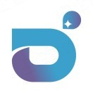

  

  # 智元精灵具身智能TOP100合作

  **全球具身智能企业融资雷达**

  ### [点击进入在线榜单](https://embodied-ai-funding-radar.app.workbuddy.host/)

  打开即用 · 无需登录 · 手机 / 桌面自适应

---

## 这是什么

一页式追踪全球具身智能（Embodied AI）企业的融资动态、估值水位与轮次分布。以智元机器人合作生态为核心向外延展，覆盖本体层 / 模型层 / 基建层共 **128 家企业**，并单列全球具身方向的高校实验室榜单。

## 核心功能

| 视图 | 内容 |
| --- | --- |
| **企业估值榜** | 128 家企业的估值、累计融资额、最新轮次、投资方与所处分层；支持按层级 / 赛道 / 轮次筛选与关键词搜索 |
| **具身 LAB 排名** | 高校实验室、核心人物、论文引用量与代表作、论文得分，已建联的实验室单独标注 |
| **融资事件流** | 按时间倒序的融资事件时间线，支持卡片与列表两种浏览方式、可按赛道下钻 |
| **赛道细分地图** | 本体层 / 模型层 / 基建层分组呈现企业分布，直观看各细分赛道的拥挤度 |
| **趋势图表** | 融资额、轮次结构、月度节奏等多维趋势可视化 |

## 数据口径

- **规模**：128 家企业 · 83 条融资事件 · 61 家具身 LAB
- **分层**：本体层 60 · 模型层 43 · 基建层 25（零件层不收录）
- **排序**：估值优先 → 累计融资兜底 → 两者皆缺置末，规则全程可核验
- **估值**：已披露的直接采信；未披露的按累计融资额 × 轮次倍数估算，并在界面上明确标为「估算」
- **汇率**：美元按 1 : 7.15 折算人民币
- **标注**：金色 = 数值属性、青色 = 生态关系、橙色 = 今月新进、浅蓝 = 已建联

## 在线入口

> **https://embodied-ai-funding-radar.app.workbuddy.host/**

直接点击上方链接或本页顶部的按钮即可打开，无需注册或安装。

---

本仓库仅作为项目对外入口页。
